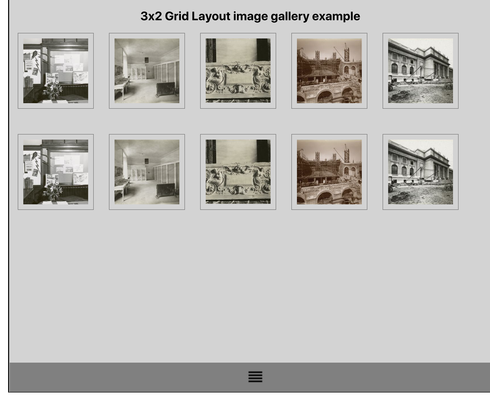

# Curtain List

### Description

On top of the page is a collapsed pull-down menu bar. When the user clicks and pulls down the
bar, the user is presented a gallery of images.
The user should be able to pull the sliding menu up and down using the mouse (smooth
transition). How far the menu is opened is controlled by the mouse pointer unless it is complete
open (all rows of images are visible or the bottom of the browser window is reached) or
completely closed.


###### Sample screen:



### Get it running

- Install the dependencies -  ``` npm install ```
- Run the application - ``` npm start ```
- Run the tests - ``` npm test ```
